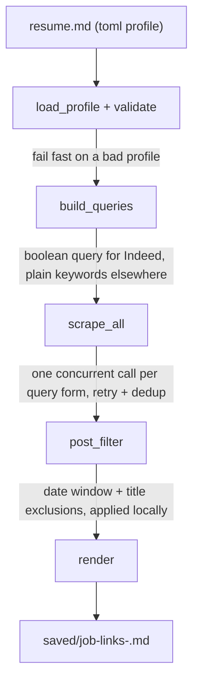

# JobSearch-Pipeline

Job boards are flaky. Each one searches differently, filters differently, and
quietly returns nothing when it's throttling you. This project wraps that behind
one command: read what you want from a profile, ask each board in the way that
board understands, filter everything once on your machine, and hand you a
markdown list of links.

Scraping itself is handled by the open-source
[JobSpy](https://github.com/cullenwatson/JobSpy) library (MIT, by Cullen Watson).
Everything in this repo that is **not** `jobspy/` is the layer I built on top of
it: profile parsing, query derivation, local filtering, retries, and reporting.
`resume.md` and `run.sh` are mine too.

## The rules I built around

The code follows five plain rules. Everything else follows from them.

1. **One config file drives everything.** The search profile lives in a TOML
   block inside `resume.md` — one editable source of truth for titles, location,
   keywords, freshness, and per-site query overrides. No hardcoding, no guessing
   at runtime.
2. **Fail fast.** A malformed profile dies in milliseconds with a clear message,
   before any network call. `--dry-run` prints the derived queries and exits —
   so checking a profile edit is free.
3. **Measure before deciding.** Every claim in the [What I found](#what-i-found-and-what-i-did-about-it)
   section was tested against the live boards, not assumed.
4. **Filter once, locally.** Boards can't filter consistently — LinkedIn ignores
   exclusions, Indeed over-applies them. So one rule runs on your machine and
   every board behaves the same.
5. **Make output self-explanatory.** Each report records the exact query used per
   site, so a thin result set is easy to diagnose later instead of a mystery.

## How it works



| Step | What it does | Why |
|---|---|---|
| `load_profile` + `validate` | Extract and type-check the TOML block from `resume.md` | Rule 2: fail fast with an actionable message |
| `build_queries` | One query per board — boolean for Indeed, plain keywords for the rest | Boards parse queries differently |
| `scrape_all` | Scrape, retry on empty, dedup on `job_url` | Boards throttle by returning nothing |
| `post_filter` | Date window + title exclusions, applied once, locally | Rule 4: one rule, every site |
| `render` | Markdown report of clickable links | Rule 5: records its own queries |

## Usage

```bash
./run.sh                # scrape using the profile in resume.md
./run.sh --dry-run      # print the derived queries, scrape nothing
./run.sh --site indeed,linkedin --results 50
```

Requires Python 3.11+ (the profile parser uses the standard library `tomllib`).
`run.sh` creates the virtualenv and installs the package on first run. Reports
are written to `saved/job-links-<timestamp>.md`.

| Flag | Effect |
|---|---|
| `--dry-run` | Print the profile and derived queries, then exit without scraping |
| `--site` | Comma-separated sites (default `indeed,linkedin`) |
| `--location` / `--country` | Override the profile's search location |
| `--results` | Override `results_per_site` |
| `--hours-old` | Override the freshness window |
| `--retries` | Retry count for a site group returning nothing (default 1) |
| `-v 0\|1\|2` | Verbosity: errors only / +warnings / all logs |

## The profile

`resume.md` contains one fenced `toml` block under `## Job Search Profile`:

```toml
[titles]
primary = "GenAI Developer"
also    = ["Generative AI Engineer", "AI Engineer"]

[search]
location         = "Bengaluru, India"
country          = "India"
hours_old        = 72
results_per_site = 30
indeed_date_filter = false

[keywords]
core    = ["Python", "FastAPI", "LangChain", "RAG", "LLM", "React"]
exclude = ["Senior", "Lead", "Principal", "Staff", "Manager"]

[queries]
indeed = '"Gen AI" (Python OR FastAPI OR LLM)'
```

| Field | Required | Meaning |
|---|---|---|
| `titles.primary` | yes | Best-fit title. Becomes the quoted phrase in the Indeed query |
| `titles.also` | no | Alternative titles, for reference |
| `search.location` | yes | Free text; commas are safe because it is TOML |
| `search.country` | no | Indeed/Glassdoor country. Must match a `Country` value |
| `search.hours_old` | no | Keep jobs posted within N hours. Applied locally |
| `search.results_per_site` | no | Target count per site (default 10) |
| `search.indeed_date_filter` | no | Also pass the window to Indeed's own filter. Off by default |
| `keywords.core` | yes (min 2) | Ordered by significance. First 6 reach the query |
| `keywords.exclude` | no | Dropped from job titles locally, on every site |
| `queries.indeed` | no | Overrides the derived Indeed query |

TOML rather than comma-separated prose because values legitimately contain
commas (`location = "Bengaluru, India"`) and quotes.

### Maintaining the profile

The repo ships an [opencode](https://opencode.ai) skill at
`.opencode/skills/job-search-profile/SKILL.md` that keeps the TOML profile in
sync with your actual resume. Ask opencode to *"update my job search profile"*
and it reads `resume.md`, rewrites **only** the toml block, never invents skills
the resume doesn't evidence, and reports the exact queries the change will
produce. Verify with `./run.sh --dry-run`. `resume.md` itself is gitignored
(contact details), but the skill file documents the full profile contract.

## What I found, and what I did about it

Measured against the live boards, not assumed. Same title and window, Bengaluru,
radius 50, `hours_old = 72`.

| What I saw | What I did | What it cost |
|---|---|---|
| LinkedIn ignores `-Senior` — senior jobs still show up | Drop those words from titles myself | Titles are filtered, not the query |
| On Indeed, exclusions work but 5 of them cut 8 results to 1 | Never send exclusions to Indeed; filter locally | More results to skim |
| Boards "throttle" by returning nothing, not an error | Retry once, waiting 12s, when a site group comes back empty | Up to 12s slower worst-case |
| The same Indeed query gave 5 results one minute, 0 the next | Report every site's count, including zeros | A blank site is visible, not silent |
| Indeed's own date filter works but halves results in a thin market | Leave it off; one local rule covers all sites | Larger fetch volume |

The exclusion numbers, for the record:

| query | rows | senior |
|---|---|---|
| `GenAI Developer` | 9 | 5 |
| + 3 `OR` terms | 8 | 4 |
| + 6 `OR` terms | 8 | 4 |
| + 6 `OR` terms + 5 excludes | **1** | **0** |

The exclusions did exactly what they should — zero senior rows — but five of
them turned 8 rows into 1. That's the whole argument for filtering locally.

Also measured: Indeed's `OR` group barely matters (0 / 1 / 3 / 6 terms gave
9 / 8 / 8 / 8 rows), so it isn't worth lengthening. And some boards are blocked
from many IPs rather than broken — Naukri `406`, ZipRecruiter/Bayt `403`,
Glassdoor `400`, BDJobs empty — which is why the defaults are `indeed,linkedin`.

## What I deliberately left out

- **No web app.** A CLI is the right size for a daily personal workflow; a UI
  adds surface area without adding signal.
- **No database.** Runs are stateless. Tracking "what's new since yesterday"
  across runs is the planned next step, not this version.
- **I didn't write the scrapers.** I grouped calls by query form to use the
  library's concurrency well, instead of re-inventing a thread pool.

## Next steps

1. Add a SQLite store so each run can flag jobs that are new since the last one.
2. Smarter retries — jittered backoff and per-IP user-agent rotation.
3. A scheduled digest (cron + email) of fresh roles.

## Credits

Board scraping comes from [JobSpy](https://github.com/cullenwatson/JobSpy) by
Cullen Watson and contributors, MIT licensed. The automation layer in
`jobsearch/` is also released under the MIT license. See `LICENSE`.